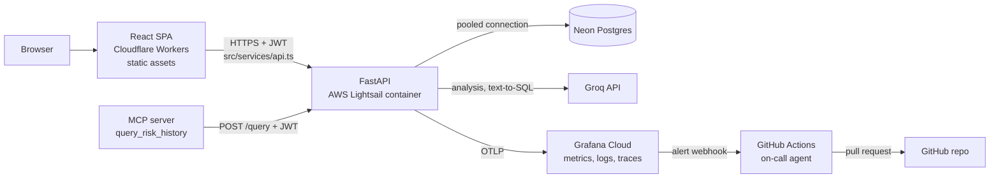
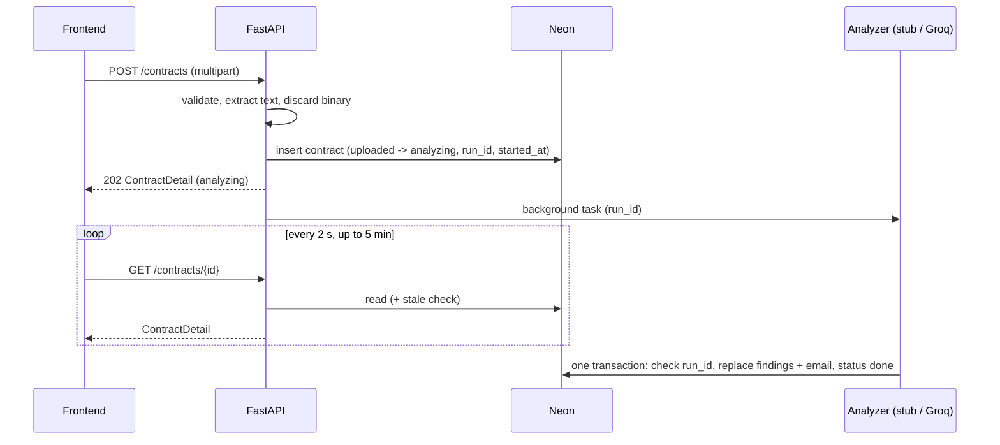
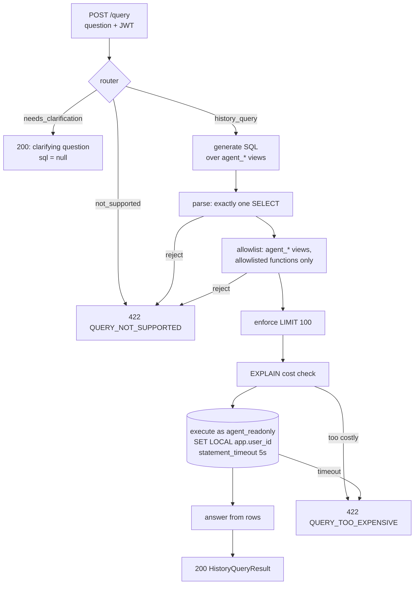
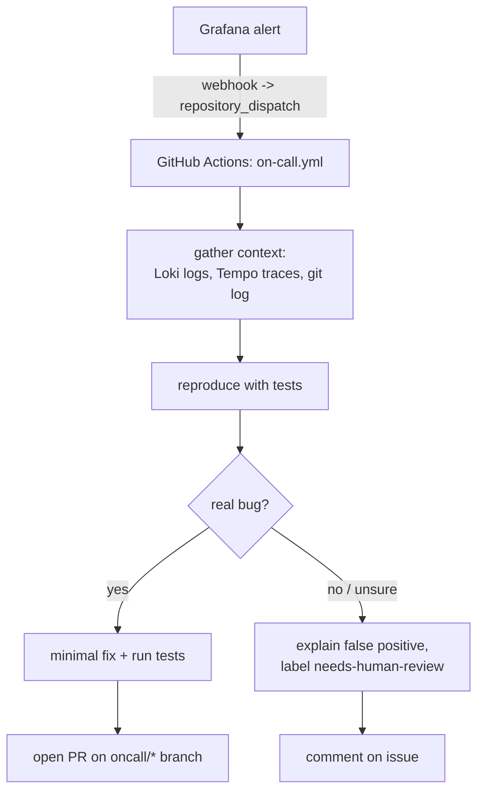
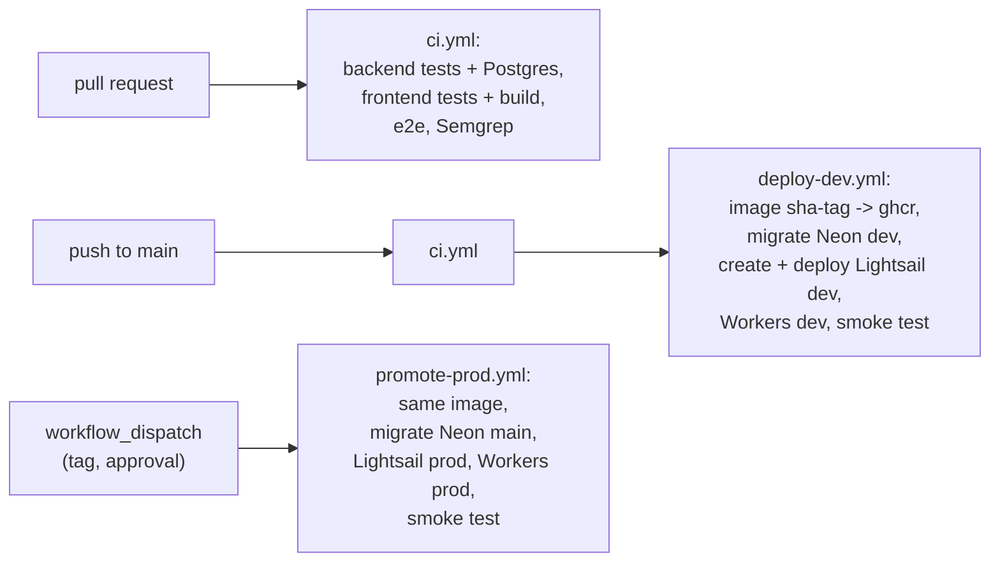

# Anti-Scope Creep — Architecture

This document describes how Anti-Scope Creep is built, hosted, deployed, and operated. Product behavior (screens, data model, API, status flow, error codes) is defined in `docs/spec.md`, which wins if the two ever disagree.

Target: **zero hosting cost** on free tiers. Free-tier numbers below were checked on 2026-09-29 and change often; re-check them before relying on them (see [Facts to re-verify](#facts-to-re-verify)).

---

## 1. System overview



| Component | Technology | Hosting | Notes |
|---|---|---|---|
| Frontend | React + TypeScript (Lovable) | Cloudflare Workers static assets (`frontend/wrangler.jsonc`) | Static SPA. All API calls in `src/services/api.ts`; full mock for backend-free runs. TanStack Start SPA mode, build output `frontend/.output/public`; the shell is `index.html`, and `not_found_handling: single-page-application` serves it for deep links. No Worker script: requests to static assets are free and unlimited. URLs: `anti-scope-creep.vadimvlasov.workers.dev` (prod), `anti-scope-creep-dev.vadimvlasov.workers.dev` (dev). Cloudflare Pages was the first plan; Wrangler now delegates new Pages projects to Workers. |
| API contract | `openapi.yaml` | repo | Contract between frontend and backend. |
| Backend | Python, FastAPI, `uv`, `pytest` | AWS Lightsail container service | One Docker image, one always-on Nano node per environment. |
| Database | PostgreSQL, SQLAlchemy, Alembic | Neon | Built-in PgBouncer pooling, branches for dev/prod. |
| LLM | Groq API | Groq cloud | Stub analyzer in Phase 1; Groq from the LLM phase. |
| Agents | LangGraph | inside the backend; on-call agent in GitHub Actions | Text-to-SQL graph behind `POST /query`. |
| MCP server | FastMCP, stdio | user's machine | Thin client of `POST /query`. |
| Observability | OpenTelemetry → Grafana Cloud | Grafana Cloud free tier | Managed Prometheus-compatible metrics, Loki, Tempo. |
| CI/CD | GitHub Actions | GitHub | OIDC role in AWS, no long-lived keys. |
| Images | Docker | GitHub Container Registry (public) | See [Container registry](#container-registry). |

---

## 2. Contract analysis flow



Rules that matter for the infrastructure (full definitions in `docs/spec.md`):
- **Keep until success:** a retry replaces findings and email only when it succeeds.
- **Run check:** a task commits only if the contract is still `analyzing` with the task's `analysis_run_id`.
- **Stale analysis rule:** an `analyzing` contract older than `ANALYSIS_STALE_AFTER_SECONDS` (default 600) becomes `failed` on its next read or change. This is the safety net for lost background tasks.

### Background work on Lightsail

FastAPI `BackgroundTasks` run in the same process after the response is sent. A Lightsail container service keeps its containers running: CPU is not throttled between requests and the service does not scale to zero, so in-process tasks run normally after the `202` response. A container can still be replaced (deploy, node restart), and the stale rule covers that.

**Decision:** in-process `BackgroundTasks` plus the stale rule. The analysis runner sits behind an interface (`AnalysisRunner.schedule(contract_id, run_id)`), so it can be swapped for a task queue (for example, SQS with a worker container in the same deployment) if tasks get lost too often. That swap changes no public API.

**Cost.** Lightsail bills by the hour up to the monthly price, for as long as a container service exists, busy or idle, enabled or disabled; only deleting it stops the charge. Nano power (0.25 vCPU, 512 MB) costs 7 USD/month per node (about 0.0096 USD/hour) and includes 500 GB of data transfer. So **prod is permanent** (7 USD/month) and **dev is ephemeral**: the deploy workflow creates the dev service when it needs it, and a nightly workflow deletes it, so a dozen hours of dev a month cost about 0.12 USD. Both are paid from the AWS Free Tier credits (100 USD, valid until 2027-05-08). Set an AWS budget alert that ignores credits, and delete the prod service when the project is no longer demoed.

Lightsail settings: power Nano, scale 1, region `eu-central-1` (Frankfurt, the same AWS region as Neon), container port 8000 as the public endpoint (HTTPS only, default `*.cs.amazonlightsail.com` domain), health check `GET /health`.

---

## 3. Database (Neon)

### Connections

| Use | Endpoint | Settings |
|---|---|---|
| Application (`DATABASE_URL`) | **pooled** (`-pooler` host, PgBouncer transaction mode) | Disable server-side prepared statements (psycopg 3: `prepare_threshold=None`); `pool_pre_ping=True` because Neon suspends idle compute; small pool (`pool_size=5`). |
| Text-to-SQL agent (`AGENT_DATABASE_URL`) | pooled | Role `agent_readonly`; every query in an explicit transaction. |
| Migrations (`MIGRATIONS_DATABASE_URL`) | **direct** (no pooler) | Alembic needs session-level features that PgBouncer transaction mode does not provide. |
| CI tests | Postgres service container in GitHub Actions | No Neon usage in CI. |

Local development uses a single Postgres container (`docker run ... postgres:16`); unit tests may use in-memory SQLite where no Postgres-specific behavior is involved.

### Environments

- Neon branch `main` → prod.
- Neon branch `dev` → dev (branched from `main`, can be reset).
- Region: AWS `eu-central-1` (Frankfurt), the same as the backend.

### Roles and isolation for the text-to-SQL agent

```sql
-- views run with the owner's privileges; agent_readonly never touches base tables
CREATE VIEW agent_contracts WITH (security_barrier) AS
  SELECT id, title, file_type, status, created_at, analyzed_at
  FROM contracts
  WHERE user_id = current_setting('app.user_id', true)::uuid;

CREATE VIEW agent_findings WITH (security_barrier) AS
  SELECT f.contract_id, f.category, f.risk_level, f.quoted_text
  FROM risk_findings f
  JOIN contracts c ON c.id = f.contract_id
  WHERE c.user_id = current_setting('app.user_id', true)::uuid;

CREATE ROLE agent_readonly LOGIN PASSWORD '...';
GRANT SELECT ON agent_contracts, agent_findings TO agent_readonly;
ALTER ROLE agent_readonly SET statement_timeout = '5s';
```

Per query, the backend runs `BEGIN; SET LOCAL app.user_id = '<id from JWT>'; <validated SELECT>; COMMIT;`. `SET LOCAL` is transaction-scoped, so it is safe with PgBouncer transaction pooling. If the setting is missing, `current_setting(..., true)` returns `NULL` and the views return no rows, so the default is to fail closed.

These objects are created by an Alembic migration; the role password comes from a secret.

---

## 4. LLM (Groq)

### Model choice

Groq removed `llama-3.3-70b-versatile` and `llama-3.1-8b-instant` from its free and developer tiers on 2026-08-16. The free tier now serves `openai/gpt-oss-120b`, `openai/gpt-oss-20b`, and a Qwen model.

**Decision: one model for everything, `openai/gpt-oss-120b`** (`GROQ_MODEL`), used for contract analysis, the email, and all text-to-SQL steps.

- Free-tier limits reported for `gpt-oss-120b` and `gpt-oss-20b` are the same: **30 requests/min, 1,000 requests/day, 8,000 tokens/min, 200,000 tokens/day**. The only Qwen model with published numbers (`qwen3-32b`) has a lower 6,000 tokens/min.
- With equal limits, `gpt-oss-120b` is the stronger model on published reasoning benchmarks, so it wins.
- It is a reasoning model: request `reasoning_effort: "low"` so reasoning tokens do not eat the per-minute budget.
- Trade-off: analysis and history queries share one quota of 200,000 tokens/day. The limiter below covers both.

### Consequences for analysis

- The product limit is **30,000 characters** (about 7,500 tokens, about 10 pages; typical freelance contracts and SOWs are 3–10 pages). The limit follows from the provider limits: 100,000 characters would take about 9 minutes per contract and allow only about 3 such contracts per day.
- Even 7,500 tokens plus the prompt and output exceed 8,000 tokens/min, so a long contract still cannot go in one request.
- **Chunking:** split `source_text` on paragraph boundaries into chunks of up to about 12,000 characters (about 3,000 tokens). With the system prompt (about 1,500 tokens) and structured output including reasoning (up to about 2,000 tokens), one request stays near 6,500 tokens: one chunk per minute.
- A maximum-size contract takes 3 chunks plus the email request, so **about 3–4 minutes**. That fits inside the frontend's 5-minute polling window; `ANALYSIS_STALE_AFTER_SECONDS` defaults to 600, which leaves room for rate-limit backoff.
- Daily budget: a maximum-size contract costs about 22,000 tokens, so about 9 maximum-size contracts per day, or many more short ones, minus history queries. Enough for development and a demo.
- A token-bucket limiter in the backend spaces requests below the per-minute limit; `429` responses are retried with exponential backoff (up to 5 attempts, honoring `retry-after`). When retries are exhausted, the analysis fails with the normal failure rule.
- Structured output is validated with Pydantic; quotes are verified against `source_text` (spec: Quote verification). The email is generated in a final request from the verified `high` and `medium` findings.

If the limits still hurt: use the CUAD/LoRA classifier to preselect candidate clauses and send only those to the LLM, or move to a paid Groq tier.

### Data policy

Contract text and history-query results are sent to Groq. Before the Groq analyzer is enabled, `docs/ai-data-policy.md` describes what is sent, to whom, retention on the provider side, and what the app stores. The Upload / Analyze screen states that text is sent to a third-party AI provider (spec requirement).

- **Pseudonymization before every Groq call** (spec: Pseudonymization rules). A rule-based `Pseudonymizer` (regex plus party names from the preamble and signature block) sits between the analyzer / text-to-SQL Answer step and the Groq client. It returns the pseudonymized text and an in-memory mapping, and restores placeholders in the model output before quote verification. No NER library in the MVP; Presidio or spaCy is a new dependency to discuss first.
- **Zero Data Retention.** By default Groq does not retain inference data, but may keep it for up to 30 days for reliability troubleshooting and abuse monitoring. Enable ZDR in the Groq console (Settings → Data Controls) for the project's organization before the Groq analyzer is enabled in any environment. It is an account setting, not code: record the date it was enabled in `docs/ai-data-policy.md`.
- **Location.** Groq stores customer data in Google Cloud buckets in the United States. `docs/ai-data-policy.md` states this.

---

## 5. Agent layer

### Text-to-SQL graph (behind `POST /query`)

The router classifies the **question**; uploads never go through it, since they have their own endpoint and screen.



Security layers, strongest first:
1. **Database role** `agent_readonly`: `SELECT` on two views only. A bypassed application check still cannot write or read base tables.
2. **User isolation** in the views via `SET LOCAL app.user_id`: the generated SQL never carries a user ID. This, not the parser, protects users from each other.
3. **Statement timeout** 5 s on the role.
4. **Parser checks** (SQL syntax tree): single `SELECT`, allowlisted relations and functions, no locking clauses. The function allowlist matters for isolation: `SELECT set_config('app.user_id', ...)` is a valid single `SELECT` that would rewrite the user setting, so `set_config` and `current_setting` must never be callable. Using an allowlist rather than a denylist keeps new or overlooked functions out by default.
5. **LIMIT** 100 and **EXPLAIN** cost threshold.

The main threat is **prompt injection**: a question, or a quoted clause in the data, trying to steer the model. Layers 1 and 3 hold no matter what SQL the model produces. Layer 2 holds as long as the function allowlist in layer 4 blocks `set_config`. It is worth testing whether `EXECUTE` on `set_config` can be revoked for `agent_readonly` on Neon; if it can, isolation stops depending on the parser.

Tests for this layer include adversarial SQL: multiple statements, writes, catalog access, `set_config`, `pg_sleep`, and a query that tries to read another user's contracts.

### MCP server

- One tool: `query_risk_history(question: str) -> HistoryQueryResult`.
- A thin HTTP client of `POST /query`; configured with `ASC_API_URL` and `ASC_API_TOKEN` (the user's JWT, 24-hour lifetime; the user re-issues it by logging in).
- No database credentials, no SQL, no guardrail code. There is one guarded path for both the web UI and MCP clients.
- Transport: stdio, for local clients (Claude Code, Claude Desktop).

### On-call agent



Boundaries (enforced by workflow permissions, and documented in `docs/permissions.md`):
- Write access only to `oncall/*` branches, pull requests, and issues. Never pushes to `main`.
- The workflow has no deploy credentials and no Neon or AWS access; it reads Grafana with a read-only token.
- If classification is unsure, the default is "explain + needs human review", never a silent fix.
- Merging and promoting to prod stay human.

---

## 6. Observability

- **Instrumentation:** OpenTelemetry SDK in the backend, with auto-instrumentation for FastAPI, SQLAlchemy, and HTTPX (the Groq client), plus manual spans for extraction, each analysis chunk, quote verification, and the text-to-SQL graph nodes.
- **Export:** OTLP over HTTP directly to the Grafana Cloud OTLP gateway, with no collector sidecar. Pull scraping would need a public metrics endpoint on the container service, so push is simpler. Flush exporters on `SIGTERM`, when a deployment replaces the container.
- **Logs:** structured JSON to stdout, with `trace_id`, `contract_id`, and error `code`. They go to the Lightsail container logs automatically and to Loki through OTLP logs.
- **No contract content in telemetry.** Grafana Cloud is another third party. Spans, span attributes, span events, and logs never contain `source_text`, prompts, model responses, `quoted_text`, history-query rows, or the pseudonymization mapping. HTTPX instrumentation must not record request or response bodies. Only sizes, counts, IDs, model name, token usage, and error codes are recorded. A test asserts that a fixture contract's text does not appear in exported spans or logs.
- **Metrics:**
  - `analyses_total{outcome=done|failed|stale}`
  - `analysis_duration_seconds`
  - `llm_requests_total{model,status}`, `llm_tokens_total{model}`, `llm_rate_limited_total`
  - `findings_dropped_total{reason=quote_not_found|placeholder_not_restored}`
  - `api_errors_total{code}`
  - `history_queries_total{route,outcome}`
- **Alerts:** analysis failure rate > 20 % over 15 min; any `stale` outcome; 5xx rate > 5 %; p95 `GET /contracts/{id}` latency > 2 s.
- **Health:** `GET /health` returns `200` without touching the database; `GET /health/ready` checks the database. These are operational endpoints, listed in `openapi.yaml` but not used by the frontend.

Grafana Cloud free tier (metrics, logs, traces with limited retention) is enough for this project.

---

## 7. CI/CD and environments



### Workflows

All workflows use GitHub-hosted runners, which are free for public repositories. A self-hosted runner saves nothing here and exposes the machine to workflows triggered from forks.

1. **`ci.yml`** (pull requests and pushes):
   - backend: `uv sync`, linter if configured, `uv run pytest` against a Postgres service container;
   - frontend: `npm ci`, `npm test`, `npm run build`;
   - end-to-end: Playwright against backend + Postgres + built frontend (integration-testing criterion);
   - Semgrep scan, with results saved as a workflow artifact.
2. **`deploy-dev.yml`** (after CI passes on `main`):
   - build the image once, tag it `sha-<short-sha>`, and push it to `ghcr.io`;
   - `alembic upgrade head` on the Neon `dev` branch (direct endpoint), run with the same image;
   - create the Lightsail container service `anti-scope-creep-dev` if it does not exist (dev is ephemeral; its default domain stays the same, because the random part is per account and Region), then create a deployment of that image (`aws lightsail create-container-service-deployment`) and wait until it is active;
   - build the frontend with the URL of that service as `VITE_API_URL` and deploy it to the Cloudflare Worker `anti-scope-creep-dev` (`wrangler deploy --env dev`);
   - smoke test: `GET /health/ready`, register + upload + poll with the stub.
3. **`promote-prod.yml`** (`workflow_dispatch` with an image tag, GitHub Environment `prod` with a required reviewer):
   - reuses the **same image** tested in dev;
   - migrations on the Neon `main` branch;
   - deploys it to the Lightsail container service `anti-scope-creep-prod`;
   - builds the frontend with the prod service URL as `VITE_API_URL` (the frontend is rebuilt per environment because Vite inlines env vars at build time) and deploys it to the Cloudflare Worker `anti-scope-creep` (`wrangler deploy`);
   - smoke test.

   Before the approval gate, a job checks that the tag is `sha-<short-sha>` of a commit on `main` and that the image exists in ghcr. Both deploy workflows share the steps after the image build through the reusable workflow **`deploy.yml`** (migrate, Lightsail deployment, frontend Worker, smoke test); only dev may create its service.
4. **`dev-down.yml`** (nightly schedule and `workflow_dispatch`): deletes the dev container service, which is billed until deleted.
5. **`on-call.yml`** (`repository_dispatch` from Grafana): see [On-call agent](#on-call-agent).

Migrations run **before** the new revision takes traffic, so they must be backward-compatible with the running revision (add columns first, remove them in a later release).

### Container registry

Lightsail container services pull images from public registries, so the image is a public package on `ghcr.io` (the repository is public too). If the image ever has to be private, push it to the container service itself (`aws lightsail push-container-image`) or to Amazon ECR.

### Authentication to clouds

- GitHub → AWS: OIDC identity provider `token.actions.githubusercontent.com` and one IAM role per GitHub Environment, which only this repository can assume. The trust policies match GitHub's immutable subject claim (`repo:vadimvvlasov@48059972/anti-scope-creep@1393514697:environment:<env>`): repositories created after 2026-07-15 get it by default, and it keeps a recreated repository with the same name from assuming the roles. `asc-github-deploy-dev` (environment `dev`) can create, deploy to and delete container services, because dev is ephemeral. `asc-github-deploy-prod` (environment `prod`) can only create and read deployments: it cannot create or delete the prod service. No IAM access keys are stored in GitHub.
- GitHub → Cloudflare: API token limited to Workers Scripts edit on this account, stored as an environment secret.

---

## 8. Configuration and secrets

| Variable | Where | Secret | Purpose |
|---|---|---|---|
| `DATABASE_URL` | backend | yes | Pooled Neon URL (app role). |
| `AGENT_DATABASE_URL` | backend | yes | Pooled Neon URL (`agent_readonly`). |
| `MIGRATIONS_DATABASE_URL` | CI deploy jobs | yes | Direct Neon URL for Alembic. |
| `JWT_SECRET` | backend | yes | HS256 signing key. |
| `GROQ_API_KEY` | backend | yes | Groq access. |
| `GROQ_MODEL` | backend | no | Model ID, default `openai/gpt-oss-120b`. |
| `ANALYZER` | backend | no | `stub` or `groq`. |
| `ANALYSIS_STALE_AFTER_SECONDS` | backend | no | Default 600. |
| `CORS_ORIGINS` | backend | no | Comma-separated exact origins (the `workers.dev` frontend of the environment, `http://localhost:5173`). No wildcards. |
| `OTEL_EXPORTER_OTLP_ENDPOINT`, `OTEL_EXPORTER_OTLP_HEADERS` | backend | headers yes | Grafana Cloud OTLP. |
| `VITE_API_URL`, `VITE_USE_MOCK` | frontend build | no | See spec. |
| `ASC_API_URL`, `ASC_API_TOKEN` | MCP server | token yes | MCP thin client. |

- Runtime secrets (`DATABASE_URL`, `JWT_SECRET`, later `GROQ_API_KEY`) live in GitHub Environment secrets and are passed to the container as environment variables of the Lightsail deployment. Lightsail keeps them in the deployment configuration, readable by anyone with Lightsail read access to the account, so that access stays limited to the account owner and the deploy role.
- `.env.example` in `backend/` and `frontend/` lists every variable with placeholder values; `.env` is git-ignored.

---

## 9. Security notes

- JWT in `localStorage` is readable by injected scripts. Accepted for the MVP. Mitigated by a strict Content-Security-Policy in the `_headers` file of the static assets and by never rendering contract text as HTML.
- CORS: an explicit origin list and the `Authorization` header allowed; credentials mode is not needed, since tokens are not cookies.
- Uploads: 5 MB limit checked before extraction; extension, MIME, and magic bytes checked; PDFs parsed in memory with no disk writes.
- Ownership: every contract query filters by `user_id`; other users' contracts return `404`.
- Deterministic scan: Semgrep in CI. AI-assisted audit: the reviewer subagent's output on real PRs is kept as an artifact.
- `docs/permissions.md`: what each agent (coding agents, on-call agent, text-to-SQL agent, MCP server) may and may not do.
- `docs/ai-data-policy.md`: which data goes to which LLM provider.

---

## 10. Phases and course rubric

### Recommended build order

| Phase | Scope | Result |
|---|---|---|
| 1 | Lovable frontend + mock, `openapi.yaml`, FastAPI in-memory, then SQLAlchemy + Postgres | Full product locally with the stub analyzer |
| 2 | Docker, CI/CD, Neon, AWS Lightsail, Cloudflare Workers static assets, dev/prod | Deployed MVP |
| 3 | Groq analyzer (chunking, quote verification, data policy) | Real findings |
| 4 | OpenTelemetry, Grafana Cloud, alerts, on-call agent | Observable system + diagnosis artifact |
| 5 | Text-to-SQL graph behind `/query`, MCP server | History Search works on the real backend |
| 6 | Agent extension pack, security artifacts, README reproducibility | Submission-ready |
| Stretch | CUAD/LoRA classifier + MLflow | Clause preselection before the LLM |

Deadlines: Project 1 on 2026-10-27 (at least phases 1–2), capstone on 2026-11-15.

This order moves the Groq analyzer ahead of LoRA: it is cheaper to build, makes the product real sooner, and the free-tier limits it exposes give LoRA a concrete purpose (preselection).

### Rubric coverage

| Rubric criterion | Where it is covered | Evidence |
|---|---|---|
| Problem description | README, `docs/spec.md` | README sections |
| AI-assisted development workflow | `AGENTS.md`, spec-driven process, agent logs | README section + commit history |
| Technologies / architecture | this document | diagrams |
| Frontend (+ tests) | Phase 1 | `npm test` in CI |
| API contract (OpenAPI) | Phase 1 | `openapi.yaml` |
| Backend (+ tests) | Phase 1 | `pytest` in CI |
| Database integration | Phase 1–2 | Alembic migrations, Neon |
| Containerization | Phase 2 | `Dockerfile`, local compose |
| Integration testing | Phase 1–2 | Playwright e2e in CI |
| Deployment | Phase 2 | Lightsail + `workers.dev` URLs |
| CI/CD pipeline | Phase 2 | `.github/workflows/` |
| Agent extension pack | Phase 6 | subagents/skills in repo |
| Security / audit / DevOps hardening | Phases 4 and 6 | Semgrep artifact, PR audit output, `docs/permissions.md`, on-call diagnosis log, `docs/ai-data-policy.md` |
| Reproducibility | Phase 6 | README setup → run → test → deploy |

---

## Decisions

Decided on 2026-09-29; backend hosting changed on 2026-10-04. No open decisions right now.

| Topic | Decision | Revisit when |
|---|---|---|
| Maximum contract length | 30,000 characters, all phases | Moving to a paid LLM tier, or LoRA preselection cuts tokens per contract |
| LLM model | One Groq model, `openai/gpt-oss-120b`, for analysis and text-to-SQL | Groq changes free-tier models or limits |
| CUAD/LoRA + MLflow | **Stretch goal**, built only after phases 1–6. Role: preselect candidate clauses before the LLM | Core phases are done before the capstone deadline |
| Background execution | In-process `BackgroundTasks` on an always-on Lightsail container, plus the stale-analysis rule. A task queue is the fallback behind the runner interface | Analyses are regularly lost (stale outcomes in metrics) |
| Backend hosting | AWS Lightsail container services (Nano, `eu-central-1`), paid from AWS Free Tier credits. Google Cloud Run was the first choice, but a Google Cloud billing account could not be created (`OR_BACR2_59`) | The credits run out (about 2027-05) or Lightsail pricing changes |

## Facts to re-verify

Checked on 2026-09-29 (Lightsail and AWS rows on 2026-10-04); re-check before the LLM phase.

| Fact | Source |
|---|---|
| Groq free models and limits; Llama removal on 2026-08-16 | https://console.groq.com/docs/rate-limits, https://console.groq.com/docs/deprecations |
| Groq data retention (none by default, up to 30 days for reliability/abuse), ZDR, US storage | https://console.groq.com/docs/your-data |
| Lightsail container pricing (Nano 7 USD/month per node, 500 GB transfer included) | https://aws.amazon.com/lightsail/pricing/ |
| Lightsail container services deploy images from public registries | https://docs.aws.amazon.com/lightsail/latest/userguide/amazon-lightsail-container-services.html |
| AWS Free Tier credits cover Lightsail containers | https://aws.amazon.com/free/compute/lightsail/ |
| Neon free tier (storage, compute hours, branches, scale-to-zero) | https://neon.com/pricing |
| Grafana Cloud free tier limits and retention | https://grafana.com/pricing |
| Cloudflare Workers static assets: requests to static assets are free and unlimited | https://developers.cloudflare.com/workers/static-assets/billing-and-limitations/ |
